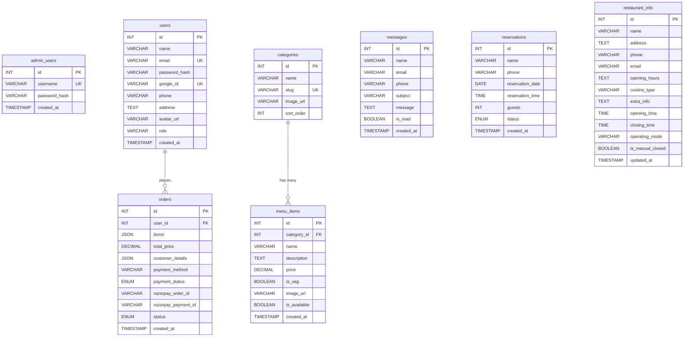

# 🏗️ System Architecture — Moonstone Café

## 1. High-Level Architecture

```
┌─────────────────────────────────┐
│        CLIENT (Browser)         │
│   React 18 + Vite + TailwindCSS│
│   Netlify CDN                   │
└──────────┬──────────────────────┘
           │  REST API (Axios)
           │  WebSocket (Socket.IO)
           ▼
┌─────────────────────────────────┐
│      SERVER (Node.js)           │
│   Express 5.2 + Socket.IO      │
│   Render.com                    │
└──────────┬──────────────────────┘
           │  mysql2 (Promise Pool)
           ▼
┌─────────────────────────────────┐
│     DATABASE (MySQL)            │
│   TiDB Cloud (Serverless)      │
│   7 Tables, SSL Encrypted      │
└─────────────────────────────────┘
           │
    ┌──────┴──────┐
    ▼             ▼
┌─────────┐  ┌──────────┐
│Razorpay │  │Google    │
│Payment  │  │Gemini AI │
│Gateway  │  │Chatbot   │
└─────────┘  └──────────┘
```

## 2. Frontend Architecture

### 2.1 Component Hierarchy

```
main.jsx
├── GoogleOAuthProvider
│   └── AuthProvider (Context)
│       └── SocketProvider (Context)
│           └── App.jsx
│               └── HelmetProvider (SEO)
│                   └── ThemeProvider (Context)
│                       └── SmoothScroll (Lenis)
│                           └── BrowserRouter
│                               └── CustomCursor
│                               └── AppContent
│                                   └── CartProvider (Context)
│                                       └── RestaurantProvider (Context)
│                                           ├── Navbar
│                                           ├── CartModal
│                                           ├── Routes (10 pages)
│                                           ├── Footer
│                                           └── ToastContainer
```

### 2.2 State Management (React Context API)

| Context | File | Purpose | State |
|---------|------|---------|-------|
| `AuthContext` | `AuthContext.jsx` | User session | `user`, `loading`, `login()`, `logout()` |
| `CartContext` | `CartContext.jsx` | Shopping cart | `cart[]`, `isCartOpen`, CRUD operations |
| `RestaurantContext` | `RestaurantContext.jsx` | Open/closed status | `restaurantInfo`, `isOpen`, auto-refresh |
| `SocketContext` | `SocketContext.jsx` | WebSocket | `socket` instance |
| `ThemeContext` | `ThemeContext.jsx` | Dark/light mode | `theme`, `toggleTheme()` |

### 2.3 Routing Map

| Path | Component | Access | Description |
|------|-----------|--------|-------------|
| `/` | `Home.jsx` | Public | Landing page with parallax hero |
| `/menu` | `Menu.jsx` | Public | Menu with category filters + cart |
| `/about` | `About.jsx` | Public | Restaurant story |
| `/gallery` | `Gallery.jsx` | Public | Photo masonry gallery |
| `/contact` | `Contact.jsx` | Public | Contact form + Google Maps |
| `/login` | `Login.jsx` | Public | User login/register + Google OAuth |
| `/profile` | `Profile.jsx` | Auth | User profile editor with avatar |
| `/orders` | `Orders.jsx` | Auth | Order history + cancellation |
| `/admin/login` | `AdminLogin.jsx` | Public | Admin authentication |
| `/admin/dashboard` | `AdminDashboard.jsx` | Admin | Full admin panel (5 tabs) |

### 2.4 API Communication Layer

The `api.js` utility creates an Axios instance with:
- **Base URL**: Hardcoded to `https://moonstonecafe.onrender.com/api`
- **Request Interceptor**: Automatically attaches JWT tokens
  - Admin routes (`/admin/`, `/status`, `/payment-status`) → `adminToken`
  - User routes → `userToken`
  - Fallback → `adminToken` if no user token

### 2.5 Design System (TailwindCSS Custom Tokens)

```
Colors:
  heritage-stone:    #F0EBE5  (Warm Linen Base)
  heritage-espresso: #2C1810  (Deep Brown Text)
  heritage-saffron:  #B84B2B  (Burnt Terracotta Primary)
  heritage-olive:    #6B705C  (Muted Sage Secondary)
  heritage-gold:     #D4AF37  (Heirloom Gold Accent)
  heritage-clay:     #E6B89C  (Soft Highlight)
  heritage-sand:     #E8E4DE  (Variation)

Typography:
  Serif:   "Cormorant Garamond" (headings, display)
  Sans:    "Manrope" (body text)
```

## 3. Backend Architecture

### 3.1 Server Stack

```
app.js (Entry Point)
├── Middleware Pipeline
│   ├── helmet()           → Security headers
│   ├── cors()             → Cross-origin requests
│   ├── express.json()     → Body parsing
│   └── express.urlencoded → URL-encoded parsing
├── Static Files
│   └── /uploads           → Served images
├── Route Mounting
│   ├── /api/auth          → authRoutes
│   ├── /api/users/auth    → userAuthRoutes
│   ├── /api/users/profile → profileRoutes
│   ├── /api/orders        → orderRoutes
│   ├── /api/menu          → menuRoutes
│   ├── /api/contact       → contactRoutes
│   ├── /api/chat          → chatRoutes
│   ├── /api/restaurant    → restaurantRoutes
│   └── /api/payment       → paymentRoutes
├── File Upload Endpoints
│   ├── POST /api/upload/image  → Menu item images
│   └── POST /api/upload/avatar → User avatars
├── Error Handler (global)
└── HTTP Server + Socket.IO
```

### 3.2 Middleware Stack

| Middleware | File | Purpose |
|-----------|------|---------|
| `protect` | `authMiddleware.js` | JWT verification, checks both `users` and `admin_users` tables |
| `optionalAuth` | `authMiddleware.js` | Attaches user if token present, continues if not |
| `validateRequest` | `validateMiddleware.js` | Joi schema validation for request bodies |
| `upload` | `uploadMiddleware.js` | Multer disk storage, 5MB limit, image types only |

### 3.3 Controller Architecture

Each controller follows the pattern:
1. Extract request parameters
2. Execute database query via `db.query()` (promise pool)
3. Emit Socket.IO events for real-time updates (where applicable)
4. Return JSON response

### 3.4 Real-Time Communication (Socket.IO)

**Events emitted by server:**
| Event | Trigger | Data |
|-------|---------|------|
| `newOrder` | Order created | `{ id, customer_details, total_price, created_at }` |
| `newMessage` | Contact form submitted | `{ name, email, phone, subject, message }` |
| `newReservation` | Reservation made | `{ name, phone, guests, date, time }` |
| `orderCancelled` | User cancels order | `{ id, cancelledBy, cancelledAt }` |
| `restaurantUpdate` | Admin updates info | `{ message }` |

## 4. Database Architecture

### 4.1 Entity Relationship Diagram



## 5. Authentication Flow

```
┌──────────┐    POST /users/auth/login     ┌──────────┐
│  User    │──────────────────────────────►│  Server  │
│  Browser │  { email, password }          │          │
│          │◄──────────────────────────────│          │
│          │  { id, name, token }          │          │
└──────────┘                               └──────────┘
     │                                          │
     │  localStorage.setItem('userToken')       │  bcrypt.compare()
     │                                          │  jwt.sign({ id, name, email })
     │                                          │  expiresIn: '30d'
     ▼                                          │
┌──────────┐    GET /users/profile          ┌──────────┐
│  Every   │───────────────────────────────►│ protect  │
│  Request │  Authorization: Bearer <token> │middleware │
│          │◄──────────────────────────────│          │
│          │  { user data }                │ jwt.verify│
└──────────┘                               └──────────┘
```

**Dual-table lookup**: The `protect` middleware checks BOTH `users` AND `admin_users` tables, enabling admin tokens to work across all protected endpoints.

## 6. Payment Flow (Razorpay)

```
1. User clicks "Pay & Place Order"
       │
2. Frontend → POST /api/payment/create-order { amount }
       │
3. Server → razorpay.orders.create() → returns Razorpay order_id
       │
4. Frontend opens Razorpay checkout modal
       │
5. User completes payment in Razorpay UI
       │
6. Razorpay callback → Frontend gets { razorpay_order_id, payment_id, signature }
       │
7. Frontend → POST /api/payment/verify { razorpay_*, order_details }
       │
8. Server verifies HMAC-SHA256 signature
       │
9. Server saves order to DB with payment_status = 'paid'
       │
10. Success response → Cart cleared, toast notification
```

## 7. Request Lifecycle

```
Browser Request
    │
    ▼
Express Middleware Pipeline
    │ helmet() → cors() → express.json()
    ▼
Route Matching
    │ /api/orders → orderRoutes.js
    ▼
Middleware Chain
    │ protect → validates JWT → attaches req.user
    │ validateRequest → validates body with Joi
    ▼
Controller Function
    │ orderController.createOrder()
    │ → db.query() → MySQL
    │ → emitEvent('newOrder') → Socket.IO
    ▼
JSON Response → Browser
    │
    ▼
Socket.IO Event → Admin Dashboard
    │ showNotification() → Sound + Browser + Toast
```

## 8. PWA Architecture

- **Service Worker**: Auto-generated by `vite-plugin-pwa` with Workbox
- **Caching Strategies**:
  - Google Fonts → `CacheFirst` (365 days)
  - `/api/restaurant` → `NetworkFirst` (30s cache, 5s timeout)
  - `/api/*` → `NetworkFirst` (5 min cache, 10s timeout)
- **Dual Manifests**: Customer app (`manifest.json`) + Admin app (`manifest-admin.json`)
- **Install Prompt**: PWA installable on mobile devices
